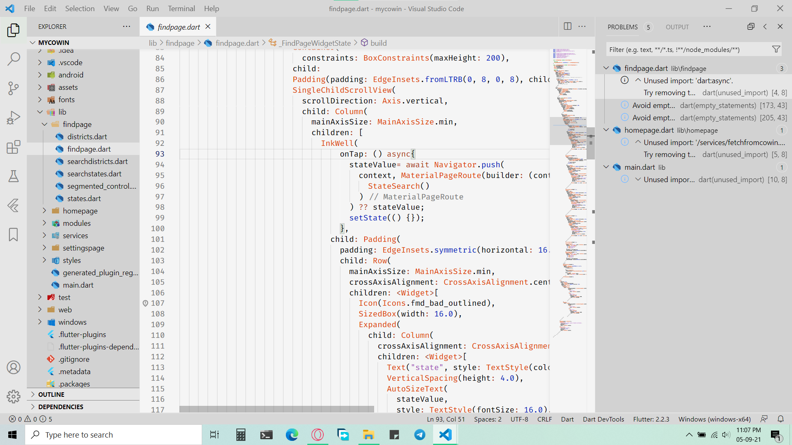

# Another(?) VSCode Light Theme
 
 
This is a Theme made after trying many VSCode light themes which were halfway there - but not completely fitting my expectations.
I needed a light theme having an easy background, font colors with enough richness and opacity, and proper black for black text.
 
## After install: set editor fontWeight to 450
 
```diff
💡 Increasing the fontweight is the key to getting most VSCode Light themes perfect.
```

* To access setting: Hit (Cntrl+,)
* Search for font weight and edit to 450 (`"editor.fontWeight": 450,`).
 
 
 
### Screenshots:



**Customizations as shown in screenshots:**

* File Icon Theme: VSCode Icons
* Font: Fira Code
 
## Known issues

**Tested for Dart/Flutter.** This is quickly made theme to fit my dart/flutter coding needs. It might not be homogenous at parts that I haven't come across yet. I am not intending to update this. Feel free to modify and distribute as it suits you.
 
 
 
 
Posted with ❤️! Code with healthy style.